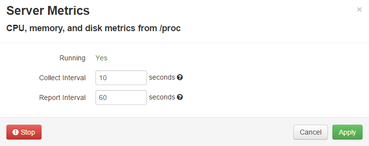
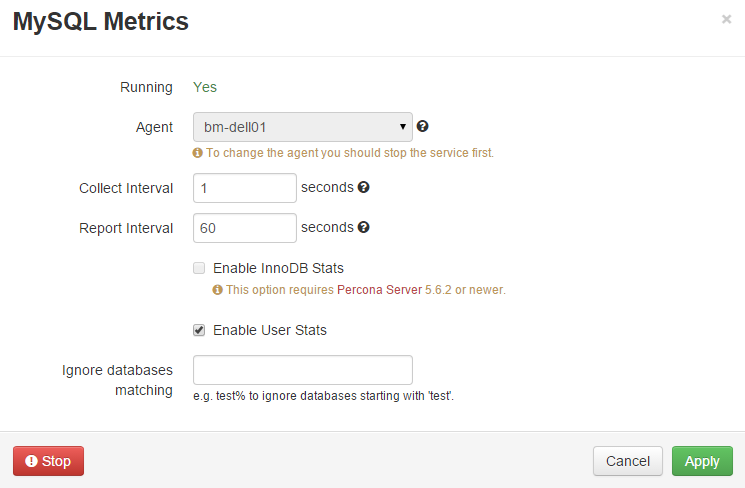
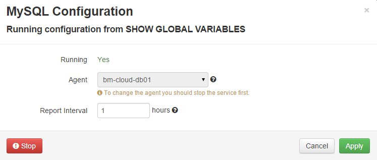
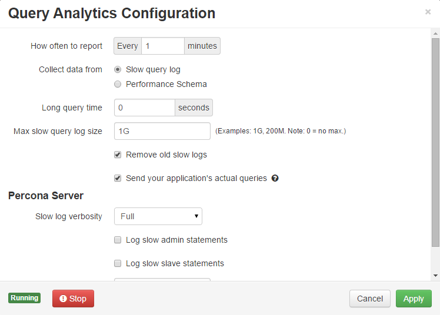
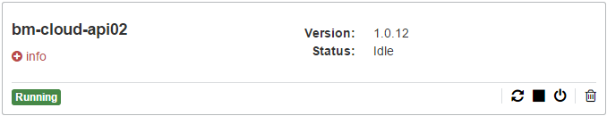
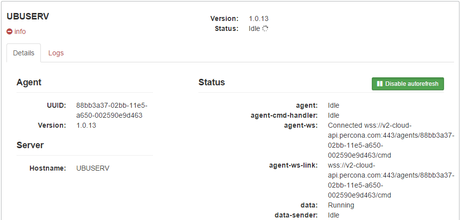
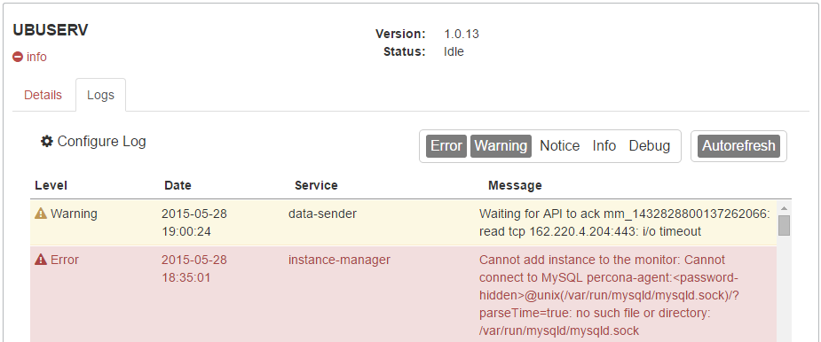
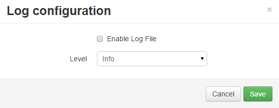
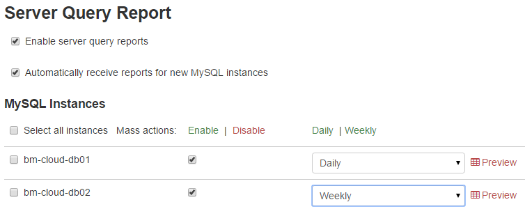

Configuration
=============

Percona Cloud Tools (PCT) provides a number of advanced configuration options.
To access PCT configuration, open the **Configure** section of the web UI.

The **Configure** section enables you to manage the following:

* Server instances
* MySQL instances
* Percona Agents
* Email reports

Server Configuration
--------------------

The **Server** tab contains information about all server instances known to PCT.
For each server, you can open :ref:`sysinfo` with a detailed report.

To configure how general server metrics are collected,
click **Server Metrics** for a specific server.
General server metrics include CPU, memory, disk,
and other critical system readings that are not related to MySQL.
These metrics are collected from the *proc* filesystem,
commonly mounted at :file:`/proc`.

The **Server Metrics** dialog enables you to:

* See the status of Percona Agent on the server (running or not)
* Stop the :command:`percona-agent` service on the server
* Configure how often Percona Agent should collect and report collected
  server metrics

When you configure necessary settings, click **Apply** to save changes.

MySQL Configuration
-------------------

The **MySQL** tab contains information about all MySQL instances known to PCT.
For each MySQL instance, you can open the :ref:`sysinfo` with detailed report.

Configuring Metrics Monitor
***************************

To configure how MySQL metrics are collected,
click **MySQL Metrics** for a specific MySQL instance.
MySQL metrics are used to populate charts for :term:`Metrics Monitor`.

The **MySQL Metrics** dialog enables you to:

* See the status of Percona Agent on the server (running or not)
* Stop the :command:`percona-agent` service on the server
* Select a local or remote agent used for this MySQL instance
  (you have to stop the :command:`percona-agent` service)
* Configure how often Percona Agent should collect and report collected
  MySQL metrics
* Enable InnoDB metrics if you are running Percona Server
  (for more information, see
  https://www.percona.com/doc/percona-server/5.5/diagnostics/innodb_stats.html)
* Enable additional user statistics if you are running Percona Server
  (for more information, see
  https://www.percona.com/doc/percona-server/5.5/diagnostics/user_stats.html)
* Ignore certain databases when collecting user statistics
  (see previous point)

When you configure necessary settings, click **Apply** to save changes.

Reporting MySQL Configuration
*****************************

To configure how MySQL configuration is collected,
click **MySQL Configuration**.
MySQL uses configuration files to store operating parameters.
Percona Agent collects MySQL running configuration
from ``SHOW GLOBAL VARIABLES`` and reports it every hour by default.

The **MySQL Configuration** dialog enables you to:

* See the status of Percona Agent on the server (running or not)
* Stop the :command:`percona-agent` service on the server
* Select a local or remote agent used for this MySQL instance
  (you have to stop the :command:`percona-agent` service)
* Configure how often Percona Agent should report MySQL configuration

When you configure necessary settings, click **Apply** to save changes.

.. _conf-qan:

Configuring Query Analytics
***************************

To configure how query data is collected,
click **Query Analytics** for a specific MySQL instance.
Query data is used by :term:`Query Analytics`.

The **Query Analytics Configuration** dialog enables you to:

* See the status of Percona Agent on the server (running or not)
* Stop the :command:`percona-agent` service on the server
* Configure how often Percona Agent should report collected query data
  (be default, query data is reported every minute)
* Select the source of query data:

  * :term:`Slow query log <slow query log>` is the default source of query data.
  * :term:`Performance Schema` is a faster and more efficient alternative
    for busy servers, available for Percona Server 5.6.9 or newer.

.. note:: For more information about the advantages and disadvantages
   of Performance Schema over the slow query log,
   see :ref:`perf-schema`.

If you select to use Performance Schema,
you truncate the ``performance_schema.events_statements_summary_by_digest``
table once when Query Analytics starts.
This ensures that there is no invalid SQL code left by third-party tools,
which may not be properly handled by Percona Agent.

The following settings are available for the slow query log:

Long query time
 Queries that take more than the specified time in seconds to execute
 are added to the slow query log.
 By default, it is set to 0, meaning that all queries are logged.

 It is not recommended to use this setting for reducing the amount of queries
 logged on a busy server,
 because the most load is produced by quick queries executed millions of times.
 If you only log queries that are longer than most,
 the workload presented by PCT will greatly differ from the actual.

 Instead, if you want to reduce overhead, use query sampling
 available in Percona Server 5.5.34 or newer.
 Sampling is enabled using the ``log_slow_rate_limit`` parameter,
 which defines the fraction of queries to log.
 This parameter can be set using the **Log slow rate limit** option
 in the *Query Analytics Configuration* dialog, as described
 in :ref:`qan-percona-server`.

Max slow query log size
 When the slow query log reaches the specified size in bytes,
 a new one is created.
 You can add a letter to the value:

 * K for kilobytes
 * M for megabytes
 * G for gigabytes

 By default, it is set to 1G,
 meaning that the maximum allowed size for the slow query log is one gigabyte.

 If you set it to 0, the log will grow indefinitely.

Remove old slow logs
 Disable this option if you want to keep old logs.
 By default, old slow query logs are replaced by new ones
 when they reach maximum size.

Send your application's actual queries
 Disable this option if you want to send only fingerprints of queries.
 This can be useful if you use MySQL to store sensitive data.
 By default, Percona Agent collects and reports full queries
 with literal values.

.. _qan-percona-server:

Query Analytics for Percona Server
^^^^^^^^^^^^^^^^^^^^^^^^^^^^^^^^^^

If you are running Percona Server, there are additional options
that enable you to configure the granularity of the slow query log.
Use these options to:

* Select the verbosity of the log:

  :Minimal: Log only queries with microsecond precision
  :Standard: Log queries with microsecond precision and InnoDB statistics
  :Full: Log all queries. This is selected by default.

* Enable logging of slow admin statements and slow slave statements

* Select the fraction of queries to log.
  By default, the ``log_slow_rate_limit`` is set to 0,
  meaning that every query will be logged (same as setting it to 1).

  If you set it to 20, then 5% of queries will be logged
  (that is, every 20th query).

.. _agent-config:

Agent Configuration
-------------------

The **Agent** tab contains information about all Percona Agents
in your PCT infrastructure.

Each panel enables you to:

* See the version and status of the agent
* Remotely control the agent as follows:

  * Restart agent service
  * Stop agent service
  * Abort agent service
  * Delete agent

* Expand agent details using the **info** link.

Agent Details
*************

The **Details**  tab under **info**  contains the agent instance UUID,
version number, hostname, and *real-time status information*.
There is status information available about every part of the agent.

By default, status is requested and updated every 5 seconds.
To disable status updates, click **Disable autorefresh**.

Agent Logs
**********

The **Logs** tab under **info** contains messages logged by the agent.

You can filter logged messages down by the required level of importance: 

:Error: Messages about events that are fatal to an operation
:Warning: Messages about events that can lead to unexpected behavior,
  or cause an error if no action is taken
:Notice: Messages about unusual events
:Info: Messages about normal operational events
:Debug: Messages useful for developers who want to debug Percona Agent

To disable updates of the log, click **Autorefresh**.

To configure log settings, click **Configure Log**.

By default, Percona Agent sends log messages to PCT,
rather than saving them locally.
This enables any user in your :term:`organization` to view log messages,
even if they do not have access to the server where Percona Agent is running.

However, there is a local log file used by Percona Agent:
:file:`/usr/local/percona/percona-agent/percona-agent.log`

To enable logging to this file, select **Enable Log File**.

The **Level** drop-down list defines how detailed
you would like the log file to be.
For example, selecting **Info** will include
*Error*, *Warning*, *Notice*, and *Info* message types.

Installation Information
------------------------

The **Install** tab contains information required for installing Percona Agent.
For example, you can copy the API key to use with the local install script.
Or copy the full command to run an automated installation of the latest version.

For more information about how to install Percona Agent,
see the :doc:`Agent` section.

Reports Configuration
---------------------

The **Reports** tab contains settings for receiving regular reports
by email from PCT.
These reports contain a digest of critical performance data
for your MySQL instances.

To enable reports, select **Enable server query reports**.
If you want weekly reports to be enabled for new MySQL instances
that you add, select **Automatically receive reports for new MySQL instances**.

You can select MySQL instances for which to enable reports.
To keep email clutter to a minimum,
disable reports for servers that are not critical,
enable weekly reports for more important servers,
and enable daily email reports only for the most active servers
where you expect frequent changes and high loads.
