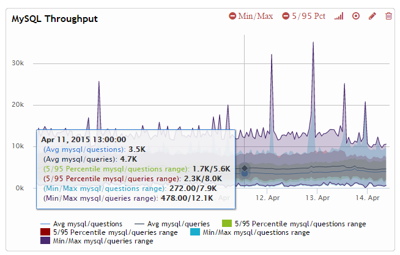

Metrics Monitor
===============

The **Metrics Monitor** tool provides an in-depth overview of metrics
that are critical to the server and database.
Metrics are presented on *charts* to show change over time.
Charts are contained within a *dashboard*.

You can add charts related to MySQL performance on one dashboard,
server availability metrics on another dashboard,
and set up separate dashboards for different members in your team.
Use the **Dashboard** drop-down list to select an existing dashboard,
create a new dashboard, or remove a dashboard.

.. note::
   * Use the **Time Range** menu to select the period of time,
     for which you would like to view metrics.
   * Use the **Host** menu to select the host that you want to monitor.

Adding Charts
-------------

A dashboard can be configured to contain several charts for various metrics.
Although a chart can contain any number of metrics,
do not overload it, unless you need to compare several metrics.
Keep it simple and separate different types of metrics across charts.

To add a chart to a dashboard:

1. Click **Add chart**.
#. Enter a name for the chart and a description.
#. Click **Add new serie**.
#. Start typing the name of the metric and select the one you need
   from the drop-down list.

   .. note:: There are many metrics available,
      separated into types and subtypes using the forward slash (``/``).
      For example, metrics that begin with ``disk/`` or ``memory/``
      are related to the general hardware and OS performance,
      while metrics related to MySQL begin with ``mysql/`` and ``mysqlvar/``.

#. Enter a custom description if necessary.
#. Select the type of the chart and the statistical value to be used.

   .. note:: The type and value depends on the metric and your needs.
      For example, you may want to see a bar chart of the count for
      created MySQL threads, and a line chart of the 95 percentile for
      MySQL query execution time.

#. Click **OK** to add the serie.
#. If necessary, add more series of metrics to the chart.
#. Click **Save** to add the chart to the dashboard.

Managing Chart Granularity
--------------------------

:term:`Percona Agent` collects data every minute,
but you can select the granularity for charts using the **Group** menu.
Available grouping depends on the current time range.
For example, if you are viewing data during last week
you can select to group data points by 5 minutes, 1 hour, or 6 hours.

This is useful for some metrics with high volatility.
If frequent spikes are not as important as the overall trend,
select a larger group to smooth out the chart.

Zooming and Synchronizing
-------------------------

Charts are interactive, meaning that you can zoom in on a period of interest.
For example, if you see a spike in throughput on a weekly chart,
you can click and drag to select the period of time when the spike occured.
By default,
all charts in the dashboard are synchronized to update to the same period,
and the corresponding custom time range is selected in the **Time Range** menu.

Synchronization is useful to isolate events
that occurred only during the period of interest.
Sometimes, you may not want to synchronize all charts when zooming.
To disable synchronization, click the **Sync** button in the **Zoom** field.

.. note:: If you already zoomed in to a chart,
   you will not be able to disable synchronization until you reset the zoom.
   You have to click the **Reset** button, which appears in the **Zoom** field,
   then disable synchronization.

If you want to keep synchronization for charts on the current dashboard,
but do not want the **Time Range** menu to update
to the corresponding custom time range,
click the **Metrics Configuration** button in the far right corner
and clear the **Enable Zoom's time range globally** check box.
In this case, the global time range will remain when you open another dashboard.

Disabling Updates
-----------------

By default, charts are updated with new data in real time
according to the granularity selected in the **Group** menu.
If you do not want to add new data to the charts,
click **Disable updates** in the toolbar.

For example, you may find a possible minor problem
that you want to analyze later.
You can disable chart updates, then come back to the problem,
find the cause, fix it, and enable updates again to continue monitoring.

Viewing Charts
--------------

Charts are arranged on a dashboard in the order they were added.
Do not overload a dashboard with too many charts.
If you have to scroll a lot, it may not be easy to find the chart you need.
Besides, charts take time to load: the more charts you have,
the greater lag you will experience when they are updated.

When you hover over a chart, a popup is displayed with the current values.
Also, a menu appears in the top part of the chart,
which you can use to customize the appearence of the chart:

* Toggle the minimum and maximum values for a metric
  according to the selected granularity.
  For example, if values are grouped by hours,
  then in addition to the average value during that hour,
  the chart will also display the maximum and minimum values for that hour.
* Toggle the 5 and 95 percentile values for a metric
  according to the selected granularity.
  For example, if values are grouped by hours,
  then in addition to the average value during that hour,
  the chart will also display the values below which 5 and 95 percent
  of observations during that hour fall.
* Toggle between linear and logarithmic scale.
  For example, if the values are too dense, switch to logarithmic scale.
* Toggle between line and dot chart
* Edit the chart settings
  (for more information about chart settings, see `Adding Charts`_)
* Remove chart from dashboard

The following screenshot shows an example of the *MySQL Throughput* metrics
(queries and questions) on a line chart with a linear scale.
The **Min/Max** and **5/95 Pct** options are enabled.

In the previous example, the mouse is hovered over April 11, 2015 at 13:00:00.
The values correspond to the following:

* On average, there were 4 700 MySQL queries per minute during the last hour
* 5 percent of observations during the last hour showed less
  than 2 300 MySQL queries per minute
* 95 percent of observations during the last hour showed less
  than 8 000 MySQL queries per minute
* The minimum amount of MySQL queries per minute during the last hour was 478
* The maximum amount of MySQL queries per minute during the last hour was 12 100

Metrics Reference
-----------------

TBD
