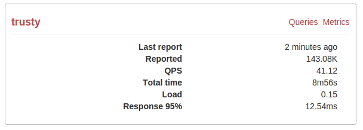

Performance
===========

The **Performance** tab provides quick reference dashboards
with information for all servers in the selected :term:`organization`.
It contains only the minimum amount of the most critical information.
You can use it for routine checks to make sure
that nothing unexpected happened in your infrastructure.
If you see a problem, there are links to the :term:`Query Analytics`
and :term:`Metrics Monitor` tools
that enable you to drill down into the root cause.

The following screenshot shows an example of the Performance dashboard
for a server named *trusty*.

The Performance dashboard provides the following information:

:Last report: When was the last performance report received
:Reported: Total size of performance reports received
:QPS: Average number of queries per second
:Total time: Total time of all executed queries
:Load: Query load calculated as a ratio of total execution time
 to the actual time.
:Response 95%: Response time for the majority of users (that is,
 95% of users get a response from the server within the specified time)

To select the reporting period, use the **Time Range** menu
in the right part of the toolbar.
You can select a predefined time range
or click the calendar icon to define a custom period.
