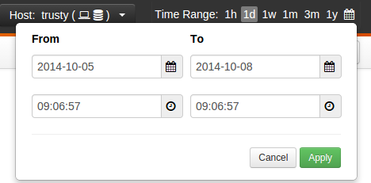
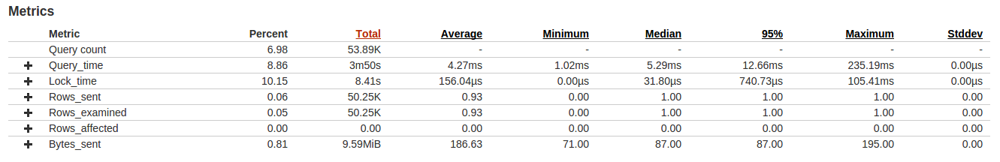
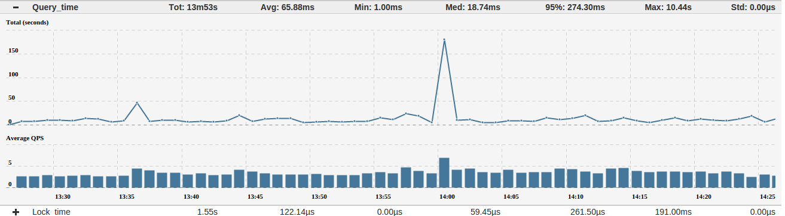
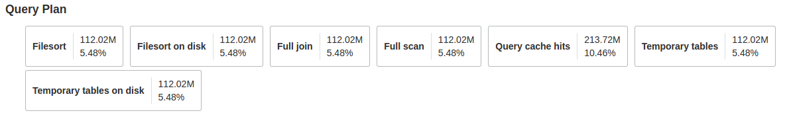
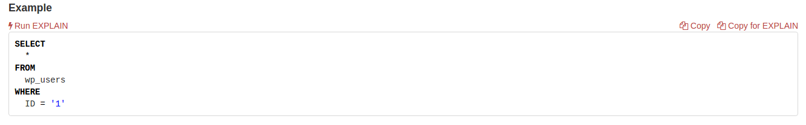
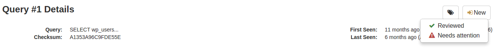
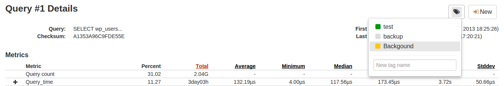
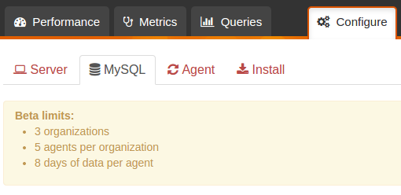
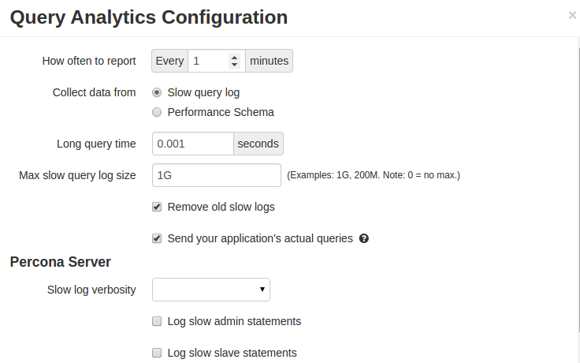
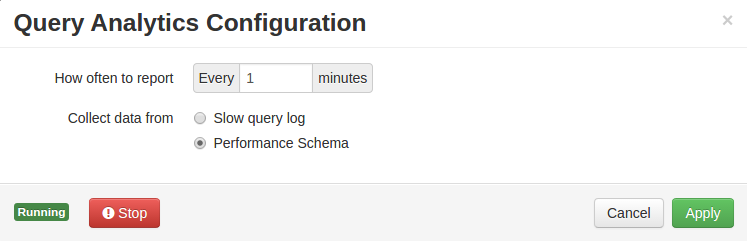

.. _query-analytics:

Query Analytics
###############

About
*****

**Query Analytics** enables DBAs and application developers to analyze MySQL queries over long periods of time and shines a spotlight on problems. Query Analytics helps you:

 * Be sure your queries (tasks) are performed as expected
 * Queries are executed within the time frame you need
 * If not, then you will be able to see which query (or several) are problematic and requires attention
 * Get detailed metrics for each query

Query Profile
*************

Query profile provides the general information about the queries executed on the server. Query profile will show you which queries takes the most time in the database, and information on how many queries execute, total time they took, average time per query and 95% response time.

Following information is available in the Query Profile:

 * Rank - The query's rank within the entire set of queries analyzed
 * Query - The distilled query. This is the abstracted form of a query, which makes it possible to group similar queries together. Abstracting a query removes literal values, normalizes whitespace, etc. 
 * Query ID - The query's unique ID
 * Queries - The number of times this query was executed
 * QPS - The number of queries per second that the server was executing
 * Load - The wall clock time (in seconds) server spent running the query in given time range.
 * Load % - Percentage of the wall clock time the server was running the query
 * Total Time - The total time of all executed queries (for server), or total time of fingerprinted query (for specific query). Queries with the biggest Total time value are causing most of the server load.
 * Avg Time - The average time of query execution
 * 95% - The 95th percentile; 95% of the values are less than or equal to this value. Shows user experience in most of the cases.
 * Max Time -  The longest period of time for query to be executed. Shows the worst user experience.

You can sort these queries by load they were causing on server (SUM) or by the amount of time it took to server to run them (MAX).

You can filter this information for the time period by selecting the predefined time periods or by creating your own by selecting the calendar icon. 

Queries can also be filtered by :ref:`query_tags` and :ref:`query_status`.

When you click on any of the queries in the list you'll  get more details in the Query Details section. Query details provide the additional information:

* Query Metrics - This section provides the detailed query metrics for the selected query. Some of the provided metrics are: Query count, Query_time, Lock_time, Rows_sent, Rows_examined, Rows_affected, and Bytes_sent. 

For each of the metrics Query Analytics provide the historic data. Each of the metrics can be sorted by: Percent, Total, Average, Minimum, Median, 95%, Maximum, and Standard Deviation to provide the additional and historic information:

* Query Plan - This section shows information about the query plan for the selected query. Information available is: Filesort, Filesort on disk, Full join, Full scan, Query cache hits, Temporary tables, Temporary tables on disk:

* Query Example - This section provides the real example of the selected query. 
 

With **Query Analytics** you can run the `EXPLAIN` command just by clicking the ``Run EXPLAIN`` from the **Percona Cloud Tools** without copy/pasting it to the server. **NOTE:** For server versions prior to 5.6, only ``EXPLAIN`` for ``SELECT`` is available due to server implementations. Running ``EXPLAIN`` for ``UPGRADE``/``INSERT``/``DELETE`` is available for MySQL and Percona Server 5.6 or newer, but you'll need to add the additional grants to the ``percona-agent`` user. 

.. _query_status:

Query Review
============

Query Review gives you the right resources to efficiently review your application's most important database activities. This enable you to assess, categorize, and comment on each of your application's queries.
New, Reviewed, Needs Attention

When you review your application's queries, Percona Cloud Tools will keep track of queries that have been evaluated. All queries can be marked as ``New``, ``Reviewed``, or ``Needs attention``. All the queries are marked as ``New`` by default. These three phrases will save you significant time and can help you more efficiently perform query analysis as a team. New filters in Percona Cloud Tools also allow you to quickly assess the performance of new queries introduced in your latest code deployment.

.. _query_tags:

Query Tags
==========

Query tags are a flexible way to allow your team to use your own language to categorize queries. There are many ways to use tags. One approach we recommend is to record which queries belong to different sub-systems of your application such as ``checkout`` or ``hotel-search``. This should help to connect the experiences of your application's users to the underlying queries.

Comments
========

Comments enable you and your team to better collaborate on improving the performance of your application as a team. Anyone that is a part of your organization can read and create query comments.
 
Configuring Query Analytics
***************************

Query analytics use the MySQL slow query log to gather the data. Although the default values should be good for most of the users, you can configure the analytics to provide additional data or change the data source from slow query log to Performance Schema.

In order to configure the Query Analytics you need to go to "Configure" tab, select "MySQL" and find your server in the list. 

You click on Query Analytics:

.. image:: images/qa_config.png

Here you can change the values of Long query time, maximum size of the slow query log, removing the old slow query logs and will the agent send and store the real queries or will the query fingerprints be used instead.

.. _qa_performance_schema:

Using Performance Schema 
========================

The MySQL slow log is a wealth of indispensable data about queries that you cannot get anywhere else. That's why it's the default for Percona Cloud Tools Query Analytics. Like most things, however, it has tradeoffs: for one, it can be time-consuming to parse, especially on very busy servers. Or, in the case of Amazon RDS, the slow log may simply not be available. With MySQL 5.6 or newer (including Percona Server 5.6 or newer) you can parse queries from the Performance Schema. It's not as data-rich as the slow log, but it has the basics and it's a great alternative (and sometimes the only alternative) to the slow log.

To use the Performance Schema you'll need to enable it on the server first (by setting the ``performance_scema`` variable to ``ON``) and configure the Query Analytics to use it instead of slow log for collecting the data.

Other Reading
*************

 * `MySQL performance optimization: Don’t guess! Measure with Percona Cloud Tools <http://www.percona.com/blog/2014/01/29/mysql-performance-optimization-dont-guess-measure-with-percona-cloud-tools/>`_
 * `Measure the impact of MySQL configuration changes with Percona Cloud Tools <http://www.percona.com/blog/2014/06/11/measure-impact-mysql-configuration-changes-percona-cloud-tools/>`_
 * `PERFORMANCE_SCHEMA vs Slow Query Log <http://www.percona.com/blog/2014/02/11/performance_schema-vs-slow-query-log/>`_
