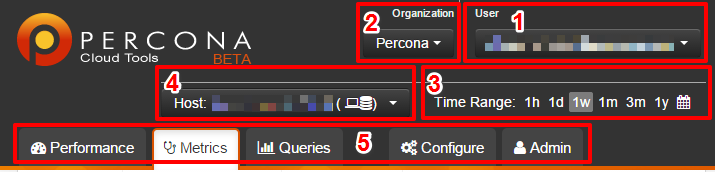

.. _console:

Percona Console
===============

Percona Console is a simple and very powerful web interface
for monitoring and analyzing collected MySQL performance data.
You can see your whole infrastructure, manage it, configure,
and analyze collected data to improve performance.

The top part contains all the main controls,
while the bottom part is reserved for displaying data.

1. The **User** menu enables you to manage your :term:`PCT Account`,
   switch to another one, or log out.
2. The **Organization** menu enables you to select the :term:`organization`
   that you want to monitor.
   All organizations, where the current :term:`user` is a member,
   are listed in the drop-down list.
3. The **Time Range** menu enables you to select the time range for monitoring.
   Only data collected during the selected time range will be available.
   You can choose one of the predefined options
   (last hour, day, month, three months, year) or select a custom range.
4. The **Host** menu enables you to select the host that you want to monitor.
5. The following tabs let you access various modules of Percona Console:

   :Performance: This tab contains a dashboard with a status summary
    for all hosts in your infrastructure.
   :Metrics: This tab contains the :term:`Metrics Monitor` module.
   :Queries: This tab contains the :term:`Query Analytics` module.
   :Configure: This tab contains all the configuration settings.
   :Admin: This tab contains advanced configuration settings
    available only to users with *Admin* and *Owner* rights
    in the selected :term:`organization`.

System Info
-----------

*System Info* provides information about the status
and configuration of the server and MySQL instance.
This report is generate by :term:`Percona Agent`
using the :command:`pt-summary` and :command:`pt-mysql-summary` tools
in :term:`Percona Toolkit`.

To enable *System Info*:

* :ref:`Install Percona Agent <agent>` (version 1.0.7 or later).
* `Install Percona Toolkit <http://percona.com/doc/percona-toolkit/2.2/installation.html>`_.

To access the *System Info* report, click the **System Info** link
in any server or MySQL instance box in Percona Console.
The report is separated into sections that cover various aspects,
such as processor and memory details for server instances,
and table cache and schema details for MySQL instances.
You can copy the whole report or sections of it to the clipboard,
and then paste it into an e-mail without losing the formatting.

For a complete reference of data provided by *System Info*,
see the documentation for the corresponding tool:

* Server summary: |pt-summary|_
* MySQL summary: |pt-mysql-summary|_

.. |pt-summary| replace:: :command:`pt-summary`
.. _pt-summary: http://percona.com/doc/percona-toolkit/2.2/pt-summary.html
.. |pt-mysql-summary| replace:: :command:`pt-mysql-summary`
.. _pt-mysql-summary: http://percona.com/doc/percona-toolkit/2.2/pt-mysql-summary.html

Instance Tree
-------------

TBD
