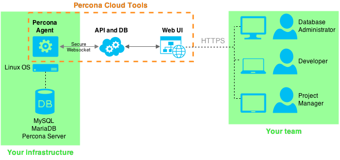

.. |PCT| replace:: :abbr:`PCT (Percona Cloud Tools)`

.. _get-started:

========================================
Getting Started with Percona Cloud Tools
========================================

|PCT| is a hosted service that helps you manage MySQL performance.

.. contents::
  :local:
  :backlinks: top

How PCT Works
-------------

*Percona Agent* collects performance data from a MySQL server, encrypts it,
and sends to |PCT| through a *secure websocket* connection.
Any members of your team can access the web application to analyse your data at
`cloud.percona.com <https://cloud.percona.com>`_
using any browser that supports
:abbr:`HTTPS (Hypertext Transfer Protocol Secure)`.

Tools
-----

|PCT| provides the following tools for analysing collected data:

* :ref:`qan` aggregates MySQL query digest data to find performance problems.
  You can see a range of metrics for each individual query
  and run diagnostic queries to see execution details.

* :ref:`mm` enables you to set up dashboards with charts
  to monitor trends in MySQL and general system performance.
  You can drill down into problematic periods
  and compare metrics to see dependencies
  that might uncover the cause of problems.

* :ref:`sys-info` provides a summary of information
  related to MySQL and system configuration.

* :ref:`reports` are a way to get critical query digest data
  delivered to you regularly.

Quick Start
-----------

If you have MySQL server running and configured correctly,
you can start using |PCT| in three easy steps:

1. **Create account**

  Go to `cloud.percona.com <https://cloud.percona.com>`_,
  create a :term:`PCT Account` and log in.

2. **Get your API key**

  Get your :term:`API key` at
  `cloud.percona.com/api-key <https://cloud.percona.com/api-key>`_.

3. **Install Percona Agent**

  Log in to your MySQL server as **root** and run the following command:

  ::

  $ curl -s https://cloud.percona.com/install | bash /dev/stdin -api-key="<API key>"

:download:`Check out this video to see how easy it is to get started
<files/getstarted.mp4>`

For more information about installing Percona Agent,
see the :ref:`Installation Guide <install>`.

Switching Organizations
-----------------------

When you register a PCT account, a default organization is created for you.
You can use this default organization to get started.
You can also create other organizations and be added to existing organizations.

To switch between organizations,
use the drop-down menu above the *Instance Tree*.

For more information about organizations, see :ref:`users-orgs`.

Using the Instance Tree
-----------------------

The *Instance Tree* is a hierarchical representation of your infrastructure,
which corresponds to the currently selected organization.

* An *OS instance* represents a physical or virtual machine.

* An *Agent instance* represents a **percona-agent** service
  running on the machine.

* A *MySQL instance* represents a MySQL server on the machine.

Selecting Time Range
--------------------

|PCT| displays data collected during the time range
selected in the **Time Range** menu.
You can choose one of the predefined options
(last hour, day, month, three months, year) or select a custom range.