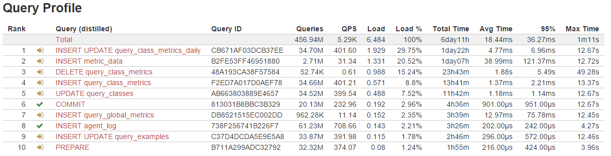
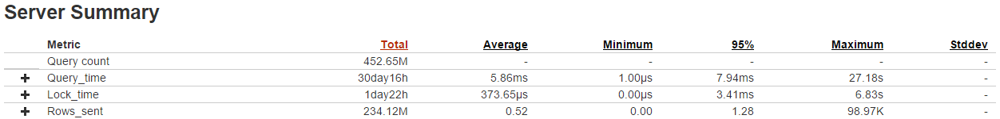
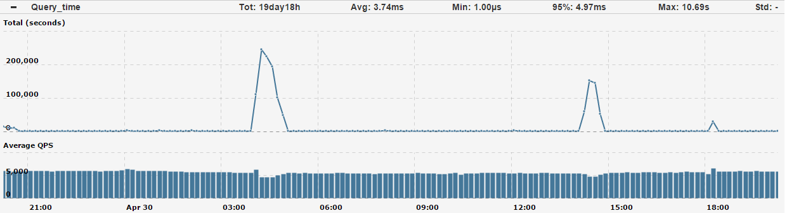

.. _qan:

===============
Query Analytics
===============

Setting Up Dashboards
---------------------

The **Query Analytics** tool enables database administrators
and application developers to analyze MySQL queries over periods of time
and find performance problems.
Query Analytics helps you optimize database performance
by making sure that queries are executed as expected
and within the shortest time possible.
In case of problems, you can see which queries may be the cause
and get detailed metrics for them.

Query Profile
-------------

The **Query Profile** section provides a list of queries
executed on the server in the specified period of time.
It also shows valuable performance information about each query.

The following screenshot shows an example of the Query Profile table:

By default, the table lists ten queries with the highest total execution time.
Use the **Sort by** field in the toolbar to change how queries are sorted:

:SUM: Sort queries by total execution time (this is the default)
:MAX: Sort queries by maximum execution time

A box below the table shows the number of queries listed
and the percentage of them compared to all queries.
To show ten more queries in the table, click the button with the plus sign.

The following information is available in the *Query Profile* table:

:Rank: Determined by the calculated load (see *Load*).

:Query: The fingerprint of a query, where literal values are removed,
 whitespace normalized, etc.
 Similar queries with the same fingerprint are grouped together.

:Query ID: Unique identifier of the query.

:Queries: Number of times this query was executed during the selected period.

:QPS: Average number of queries per second for the selected period.

 For example, ``INSERT metric_data`` was executed 34.7 million times
 during the last 24 hours (the previous example shows a one day period).
 If you divide 34.7 million queries by 86.4 thousand seconds,
 you get 401.6 queries per second.

:Load: Abstract measure of intensity for the query,
 calculated as the total time it took to execute all queries (see *Total Time*)
 divided by the actual time that passed.

 For example, ``INSERT metric_data`` was executed 34.7 million times
 during the last 24 hours with an average execution time of 38.99 milliseconds
 (see *Avg Time*).
 This adds up to a total execution time of 1 day and 7 hours (31 hours).
 If you divide 31 hours by 24 hours that actually passed during the period,
 you get a load value of 1.331.

:Load %: Percentage of the load this query produced
 compared to the total load of all queries.

 For example, ``INSERT metric_data`` has a load value of 1.331,
 which is 20.52% out of the total 6.484 load for all queries combined.

:Total Time: Total time it took to execute all queries.
 Queries with the biggest total time are causing the most load.

:Avg Time: Average time it took to execute one query,
 calculated as the total time divided by total number of queries.

:95%: The 95th percentile is the maximum time it took to execute 95% of queries.
 Only 5% of queries took more time to execute.

 This is an important measure of what the majority of users are experiencing.
 If the 95th percentile is low, then it is generally not a problem
 to see high values of maximum execution times (see *Max Time*)
 for only several queries.

:Max Time: Maximum time it took to execute query.

 This may not be a good indicator of query performance,
 because it may have taken a long time to execute only several times
 out of millions during a specific period.
 You should use this value in combination with 95th percentile (see *95%*).

Server Summary
--------------

The **Server Summary** section provides a list of metrics
for queries currently displayed in the `Query Profile`_ table.
Some of these metrics are *Query count*, *Query_time*, *Lock_time*, *Rows_sent*,
and so on.

The following screenshot shows an example of the Server Summary table:

The values depend on the units used by the specific metric.
However, the columns in the table are the same for all metrics:

:Total: The count of whatever units are used by the metric.

 For *Query_time*, it is the total execution time of queries,
 for *Rows_sent*, it is the total rows in MySQL tables that were sent,
 and so on.

:Average: The average of whatever units are used by the metric.

 For *Query_time*, it is the average execution time per query,
 for *Rows_sent*, it is the average rows in MySQL tables sent per query,
 and so on.

:Minimum: The minimum of whatever units are used by the metric.

 For *Query_time*, it is the minimum execution time for a query,
 for *Rows_sent*, it is the minimum rows in MySQL tables sent by a query,
 and so on.

:95%: The 95th percentile of whatever units are used by the metric.
 It represents the maximum value for 95% of queries
 (it is lower for the remaining 5%).

 For *Query_time*, it is the maximum execution time for 95% of queries,
 for *Rows_sent*, it is the maximum amount of rows sent by 95% of queries,
 and so on.

:Maximum: The maximum of whatever units are used by the metric.

 For *Query_time*, it is the maximum execution time for a query,
 for *Rows_sent*, it is the maximum rows in MySQL tables sent by a query,
 and so on.

Historical data for metric
**************************

To see historical data for a metric, expand the metric.
This opens a time graph with the *Total* values plotted above *Average QPS*.
The following screenshot shows an example of the time graph
for the *Query_time* metric:

The previous example contains data for the last day in 10-minute periods.
The time span and granularity depend on the **Time range** setting
(for more information, see :doc:`WebInterface`).

The *Total* graph shows the total time it took to execute queries
for each 10-minute chunk.
You can compare this to the global average queries per second.
For example, in the previous screenshot,
you can see how spikes in total execution time
correspond to small drops in *Average QPS*.

Query Details
-------------

The **Query Details** section opens in place of the `Server Summary`_ section
when you select a specific query in the `Query Profile`_ table.
This way you can drill down into data related to a particular query.

In addition to the query name and checksum (unique identifier),
the **Query Details** section provides the time and date
when the query was first and last seen.
It also contains a *Metrics* table similar to the `Server Summary`_,
as well as a *Query Plan* for the selected query.

Real-time EXPLAIN and Table Info
********************************

At the bottom of the **Query Details** section,
you can see an example of the selected query.

For information about how MySQL executes the query,
run ``EXPLAIN`` on the query.
For this, you can manually copy and paste the query to the server.

PCT enables you to run ``EXPLAIN`` for the selected query
directly from within PCT, and get a response in real time.

.. note:: If you are using Percona Server 5.5 or earlier version,
   ``EXPLAIN`` is available only for ``SELECT`` queries
   due to server implementation.
   In case of Percona Server 5.6 and later versions,
   you can run ``EXPLAIN`` for ``UPGRADE``, ``INSERT``, and ``DELETE``
   queries if you add necessary additional permissions
   to the Percona Agent user.

You can also run Table Info for the selected query.
This enables you to get ``SHOW CREATE TABLE``, ``SHOW INDEX``,
and ``SHOW TABLE STATUS`` for each table used by the query
directly from within PCT.

Reviewing Queries
-----------------

The **Query Analytics** tool enables you to review all database activities
as you go through the details for various queries.
When you select a query in the `Query Profile`_ table,
you can use the buttons in the right part of the `Query Details`_ section
to set the status for the query and categorize it using tags.
You can then filter queries according to the assigned status and tags.

At the bottom, you can add a comment for the query.
This metadata is visible by all users in your organization,
which enables collaboration for reviewing and tuning query performance.

As you review queries, change the status accordingly:

:Not reviewed: This is the default status.

:Reviewed: Select this status after you review a query
 and there are no problems with it.

:Needs attention: Select this status if a query requires deeper analysis
 or some other action associated with it.

Query tags can be used by your team to categorize queries.
Create your own set of tags,
which corresponds to your procedures and environment.
For example, one approach is to tag queries
according to the different subsystems of your application,
such as *checkout* or *hotel-search*.
This will enable you to filter queries by meaningful actions
performed by your users.

.. _perf-schema:

Performance Schema
------------------

The default source of query data for Percona Cloud Tools is the slow query log.
It is available in MySQL 5.1 and later versions.
Starting from MySQL 5.6 (including Percona Server 5.6 and later),
you can select to parse query data from the Performance Schema.

Performance Schema is not as data-rich as the slow query log,
but it has all the critical data and is generally faster.
In some cases, it may be the only alternative.

To use Performance Schema:

1. Enable it on the server by starting MySQL
   with the ``performance_schema`` variable set to ``ON``.
   For example, use the following lines in :file:`my.cnf`:

   .. code-block:: none

      [mysql]
      performance_schema=ON

   .. note:: Performance Schema instrumentation is enabled by default
      on MySQL 5.6.6 and later versions.

2. Configure Query Analytics to collect data from Performance Schema:

   a) In the web UI, select **Configure** > **MySQL**.
   b) Click **Query Analytics** for the MySQL instance you want.
   c) Select **Performance Schema** in
      the **Query Analytics Configuration** dialog box.
   d) Click **Apply** to save changes.

For more information, see :ref:`conf-qan`.

Other Reading
-------------

* `MySQL performance optimization: Don’t guess! Measure with Percona Cloud Tools <http://www.percona.com/blog/2014/01/29/mysql-performance-optimization-dont-guess-measure-with-percona-cloud-tools/>`_
* `Measure the impact of MySQL configuration changes with Percona Cloud Tools <http://www.percona.com/blog/2014/06/11/measure-impact-mysql-configuration-changes-percona-cloud-tools/>`_
* `PERFORMANCE_SCHEMA vs Slow Query Log <http://www.percona.com/blog/2014/02/11/performance_schema-vs-slow-query-log/>`_
